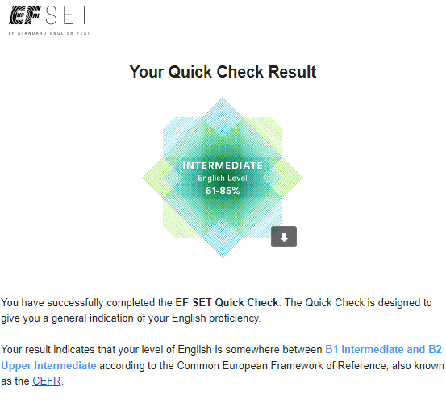

# Ogay Viktor
### **Contact information:**  

**Phone number:** +998993061369  
**E-mail:** vaogay@gmail.com  
**Telegram:** @v_ogayy  
**Discord nickname:** Ogay Viktor (@viktorogay)  

### **Briefly about myself:**  
I am a senior student of Inha University in Tashkent. I studied a lot in field of IT, especially, backend development, requirements and I tried to work in this field as a beginner, in order to get some experience.  

Two years ago my friends involved me in their startup projects I made landing page/analytics with React.js/Chart.js and recently, I decided to study in RSSchool JS/Frontend courses.  

This year I worked in the Bosch Distribution Company in Tashkent as a Software Engineer and my main task was software optimization. However, I did not really felt that this is my field of work.  

My aim is to get as much experience as I can and successfully finish the series of courses (stage 0,1,2) and start working in epam.  

### **Skills and Proficiency:**  
* Github Basics  

### **Code Example:**  
*This code does not execute properly. Try to figure out why.*  

**Code with a mistake:**  
```javascript
function multiply(a, b){
  a * b
}
```  
**Solution:**  
```javascript
function multiply(a, b){
  return a * b
}
```  
### **Experience**  
* [CV Project made during RSSchool course](https://github.com/viktorogay/rsschool-cv/tree/main)  

### **Courses**  
* Inha University in Tashkent (4-th course in progress)
* RS School JS/Front-end. Stage 0 (in progress)  

### **Languages**  
* Russian (native)  
* English (intermediate-upper-intermediate) according to EF SET Quick Check Result  


 


